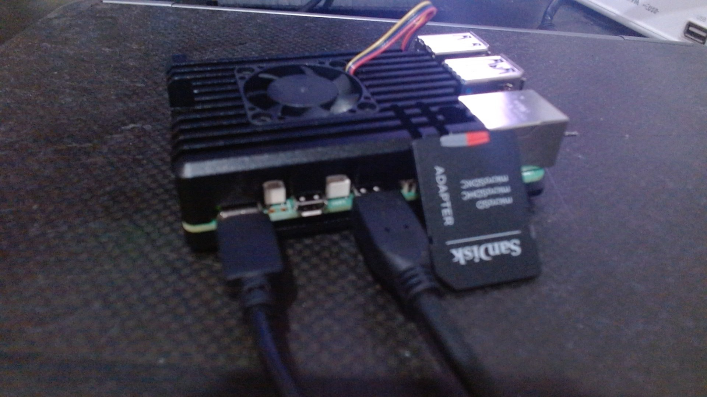
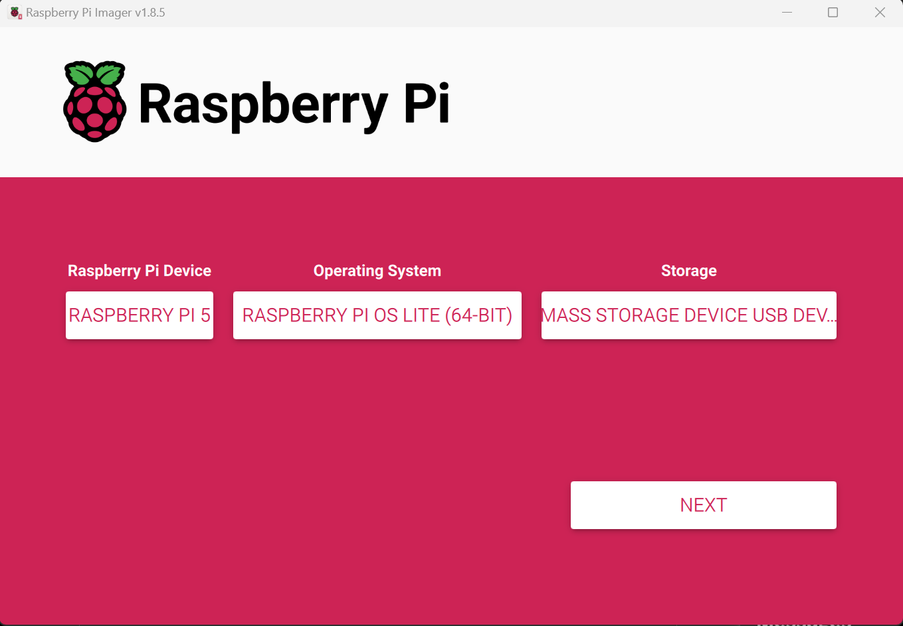
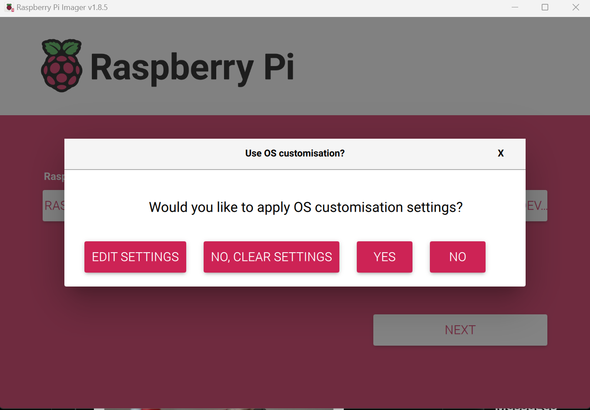
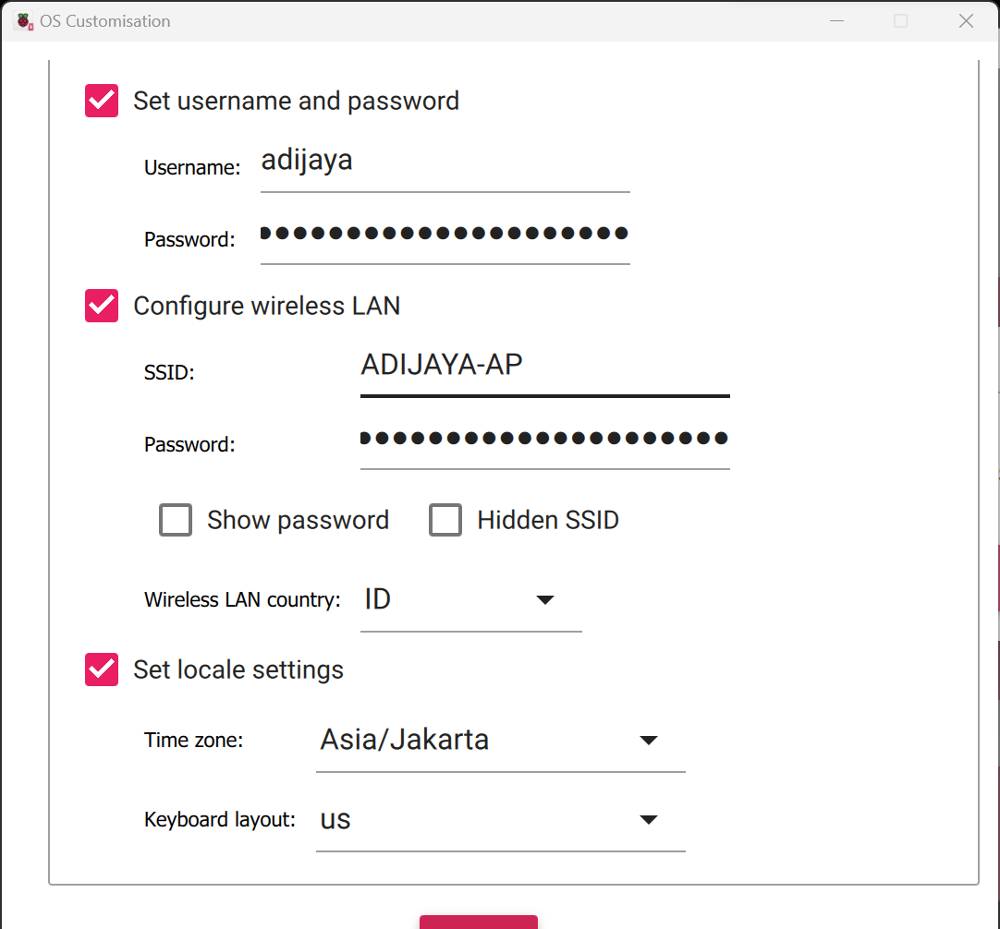
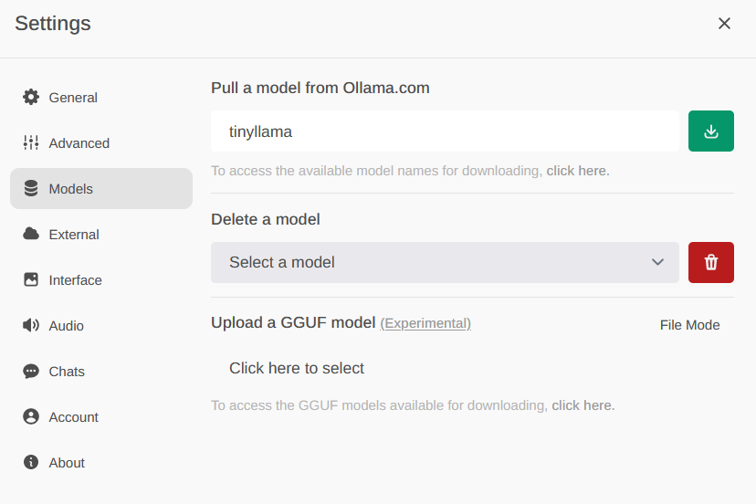

<div align="center">

# How to run OpenwebOllama-UI on Raspberry Pi 5

  

Step-by-Step Guide on how to run Large Language Model on a Raspberry Pi 5 (might work on 4 too, haven't tested it yet)

</div>

### Table of Content:

1. [Prerequisite](#prerequisite)
2. [Setup Raspberry Pi](#setup-raspberry-pi-headless-setup)
3. [setup Docker Composer](#setup-docker-composer)
4. [Setup Ollama WebUI:step-by-step Guide](#setup-ollama-webui-step-by-step-guide)
5. [Option 2: Run LLMs using Llama.cpp](#option-2-run-llms-using-llamacpp)
6. [Extra Resoucres](#extra-resoucres)

---

### Prerequisite

- [Raspberry Pi 5, 8GB RAM](https://www.raspberrypi.com/products/raspberry-pi-5/)
- 32GB SD Card

### Setup Raspberry Pi (Headless-setup)

You can also follow along this [YouTube video](https://www.youtube.com/watch?v=9fEnvDgxwbI) instead.

1. Connect the SD card to your laptop
2. Download Raspberry Pi OS (bootloader): [https://www.raspberrypi.com/software/](https://www.raspberrypi.com/software/)
3. Run it, and you should see:
   
   - "Choose Device" - choose Raspberry Pi 5
   - OS, choose the latest (64bit is the recommended)
   - "Choose Storage" - choose the inserted SD card
4. Now click next, and it will ask you if you want to edit the settings, click "Edit settings"
   
5. Configure
   
   - enable hostname and set it to `raspberrypi`.local
   - Set username and password you will remember, we will use them shortly
   - Enable "Configure Wireless LAN" and add your wifi name and password
   - Click save, and contiue. it will take a few minutes to write everything to the SD
6. Insert the SD card to your raspberry pi, and connect it to the electricity
7. SSH into the Raspberry PI:

```bash
ssh ssh <YOUR_USERNAME>@raspberrypi.local
```
### Setup Docker Composer

1. install Docker : 

```bash 
curl -fsSL https://get.docker.com -o get-docker.sh
sudo sh get-docker.sh
```
2. add user for running docker 

```bash
sudo usermod -aG docker ${USER}
```

3. Check docker installation 

```bash
sudo su - ${USER}
docker version
docker run hello-world
```
4. install docker composer 

```bash
sudo apt-get install libffi-dev libssl-dev
sudo apt install python3-dev
sudo apt-get install -y python3 python3-pip
sudo pip3 install docker-compose
```

### Setup Ollama-WebUI Step by Step Guide:

1. Download the latest snapshot of ollama-webui :  

```bash
git clone https://github.com/ollama-webui/ollama-webui webui
```

2. create a docker compose file (you can change user adijaya ):

```bash
  version: "3.9"
  services:
 ollama:
   container_name: ollama
   image: ollama/ollama:latest
   restart: always
   volumes:
     - /home/pi/ollama:/root/.ollama
 ollama-webiu:
   build:
     context: ./webui/
     args:
       OLLAMA_API_BASE_URL: '/ollama/api'
     dockerfile: Dockerfile
   image: ghcr.io/ollama/ollama-webui:main
   container_name: ollama-webui
   volumes:
     - ollama-webui:/app/backend/data
   depends_on:
     - ollama
   ports:
     - ${OLLAMA_WEBUI_PORT-3000}:8080
   environment:
     - 'OLLAMA_API_BASE_URL=http://ollama:11434/api'
   extra_hosts:
     - host.docker.internal:host-gateway
   restart: unless-stopped
  volumes:
 ollama-webui: {}
 ollama: {}
 
 ```
3. bring the container up : 

```bash 
docker-compose up -d 
```
5. Access the webui at http://localhost:3000
6. create free account for first login 
7. Download the model you want to use (see below), by clicking on the litte cog icon selecting model
   
8. For list of model [model library](https://github.com/ollama/ollama#Model-Library).

That is it!

### Option 2: Run LLMs using llama.cpp:

1. Install:

```bash
sudo apt update && sudo apt install git g++ wget build-essential
```

2. Download llama.cpp repo:

```bash
git clone https://github.com/ggerganov/llama.cpp
cd llama.cpp
```

3. Compile:

```bash
make -j
```

4. Download Mistral model:

```bash
cd models
wget https://huggingface.co/TheBloke/Mistral-7B-v0.1-GGUF/resolve/main/mistral-7b-v0.1.Q4_K_S.gguf)
```

5. Go back to repo root folder, and run:

```bash
cd ..
./main -m models/mistral-7b-v0.1.Q4_K_S.gguf -p "Whatsup?" -n 400 -e
```

That is it!

### Extra Resoucres:

- [Youtube video on how to run Ollama on Raspberry Pi](https://www.youtube.com/watch?v=ewXANEIC8pY)
- [Llama.cpp own example](https://github.com/garyexplains/examples/blob/master/how-to-run-llama-cpp-on-raspberry-pi.md)
- [Youtube video on how to setup Raspberry PI headlessly](https://www.youtube.com/watch?v=9fEnvDgxwbI)
- [Adijayainc Twitter](https://twitter.com/adijayainc)
